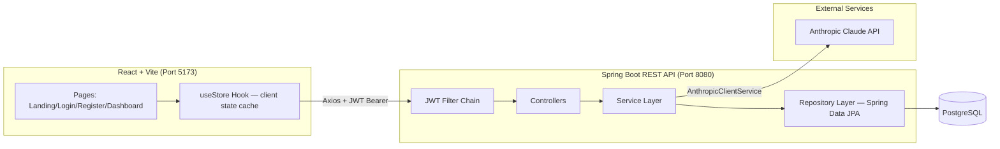
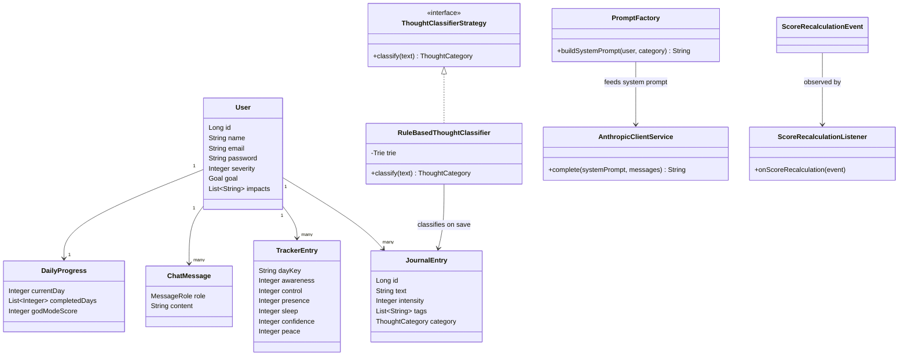
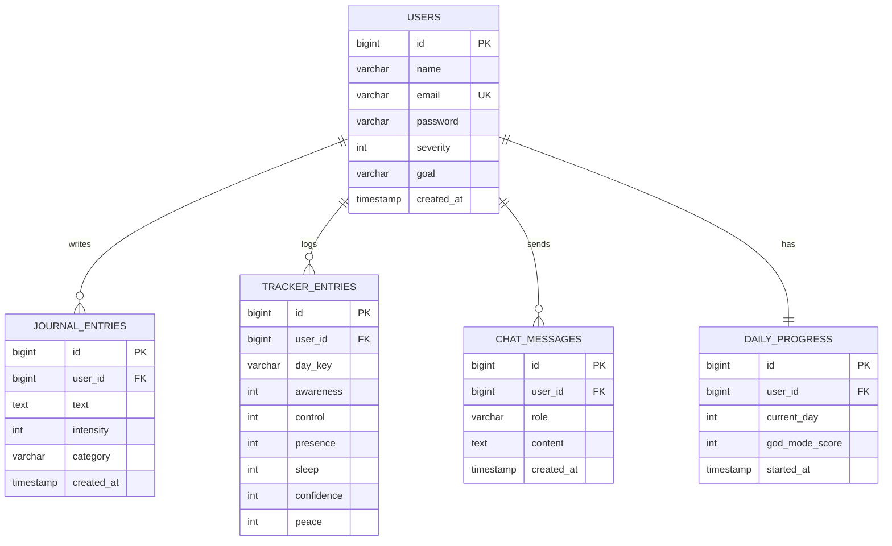

# MindShift — Architecture & Engineering Documentation

This document covers the system design, database schema, design patterns,
DSA components, and the psychology/neuroscience rationale behind the UI —
for both the **React + Vite frontend** and the **Spring Boot backend**.

---

## 1. High-Level Design (HLD)



**Why this shape:**
- **Stateless JWT auth** (no server sessions) — scales horizontally with zero sticky-session config, the same approach used at API scale by Stripe and GitHub.
- **Layered architecture** (Controller → Service → Repository) keeps each layer swappable. The frontend never talks to the database shape directly — only DTOs cross the wire.
- **Claude API isolated behind `AnthropicClientService`** — if you swap providers later (or add a fallback model), only one class changes.

---

## 2. Low-Level Design (LLD) — Class Diagram



---

## 3. Database Schema (ER Diagram)



Full DDL: `backend/src/main/resources/db/migration/schema_reference.sql`
(Hibernate auto-creates this via `ddl-auto=update` — the file is a readable reference, not a required manual step.)

---

## 4. Design Patterns Used (and *why*, not just *that*)

| Pattern | Where | Why it earns its place here |
|---|---|---|
| **Strategy** | `ThoughtClassifierStrategy` / `RuleBasedThoughtClassifier` | Lets you swap the classification algorithm (rule-based today, a real trained model later) without touching `ChatServiceImpl`. |
| **Factory** | `PromptFactory` | Isolates prompt-template construction — the one part of this codebase guaranteed to change weekly as you tune the AI. |
| **Observer** | `ScoreRecalculationEvent` / `Listener` | Journal, Tracker, and Progress services all affect the God Mode score, but none of them should own scoring logic. They publish; one listener owns the math. Runs `@Async` so it never blocks the request. |
| **Builder** | Every entity & DTO (Lombok `@Builder`) | Avoids telescoping constructors as fields grow (a `User` with 7 fields is already past the point where positional constructors are safe). |
| **Repository** | Spring Data JPA interfaces | Standard at every company running JPA — keeps persistence logic out of services entirely. |
| **DTO** | `dto.request` / `dto.response` packages | Entities never leave the service layer. The frontend never sees a JPA-managed object, so lazy-loading exceptions can't leak into JSON responses. |
| **Chain of Responsibility** | Spring Security filter chain (`JwtAuthenticationFilter`) | Framework-provided; one link does one job (validate Bearer token) and hands off. |
| **Singleton** | Every `@Service`/`@Component` (Spring-managed) | Default Spring bean scope — the Trie in `RuleBasedThoughtClassifier` is built once at startup, not per-request. |

---

## 5. DSA Components (real algorithms, not decoration)

### 5.1 Trie — multi-keyword thought classification
`backend/.../util/trie/Trie.java`
Inserts ~30 trigger phrases once at startup. Classifying a journal entry walks the trie once per starting character index — independent of how many trigger phrases exist. With N phrases and text length M, this beats N separate `.contains()` calls (O(N·M)) once your trigger library grows past a few dozen entries, which it will.

### 5.2 Top-K Frequent Elements via Min-Heap
`backend/.../service/impl/JournalAnalyticsService.java`
The exact "Top K Frequent Elements" pattern asked in FAANG DSA rounds, applied to a real feature: *what words does this user actually ruminate on most?*
- HashMap frequency count: **O(n)**
- Bounded min-heap of size K: **O(n log K)** — strictly better than sorting the full vocabulary (`O(n log n)`) once a user has thousands of journal entries.

### 5.3 Sliding window — bounded chat context
`ChatServiceImpl` pulls only the last `HISTORY_WINDOW` (10) messages via `PageRequest`, not the full conversation table, before calling Claude. Keeps token cost and latency bounded regardless of how long a user has been using the app — the same windowing technique used by every production LLM chat product.

---

## 6. Where "ML" actually lives — and where it honestly doesn't

Being precise here matters more than sounding impressive:

- **The real ML/AI component is Claude itself** (`AnthropicClientService`) — a frontier LLM doing genuine semantic understanding of a user's thought, far beyond what a hand-rolled classifier could do.
- **The Trie classifier and Top-K analytics are classical statistical/NLP techniques** (rule-based pattern matching, frequency analysis — the same idea behind TF in TF-IDF), not trained models. They're used as a **fast, free pre-processing hint** that gets passed to Claude as context, and as a **cheap analytics feature** for the trigger-words insight.
- We deliberately did **not** bolt on a fake "custom AI model" in Java — that would be slower, worse, and pointless when a real LLM is one HTTP call away. Use the right tool for each job.

---

## 7. Typography & Color — chosen for the nervous system, not aesthetics

| Choice | Rationale |
|---|---|
| **Inter** (body text) | The legibility standard at GitHub, Linear, Figma — neutral letterforms reduce the visual "decoding effort" per word, which matters when the reader's mind is already racing. |
| **Lexend** (headings) | A typeface developed and validated through reading-proficiency research, distributed as a Google Font; wider letter-spacing and taller x-height reduce reading errors under elevated cognitive load. |
| **Near-black background (`#03060F`), not pure black** | Pure black/white maximum contrast reads as "shouting" and raises arousal. A desaturated dark background with muted (not pure white) text is easier on the eyes during a 3am spiral session. |
| **Rounded corners (8–10px) everywhere, never 0px** | Shape-cognition research associates rounded forms with approachability and angular forms with alertness/threat — every CTA in a mental-health product should feel like an invitation. |
| **Warm gold + calm teal accent pairing** | Gold/amber reads as hope/achievement (used for streaks, "TODAY", wins); teal reads as calm/trust (used for the AI coach, the steady presence in the room). Red is reserved *only* for the SOS path — scarcity of the alarm color keeps it meaningful. |

---

## 8. API Reference

| Method | Endpoint | Auth | Purpose |
|---|---|---|---|
| POST | `/api/auth/register` | No | Create account, returns JWT |
| POST | `/api/auth/login` | No | Authenticate, returns JWT |
| GET | `/api/auth/me` | Yes | Current user profile |
| POST | `/api/journal` | Yes | Create journal entry (auto-classified) |
| GET | `/api/journal` | Yes | List all entries, newest first |
| GET | `/api/journal/insights/top-triggers?k=5` | Yes | Top-K frequent trigger words |
| DELETE | `/api/journal/{id}` | Yes | Delete an entry (owner-checked) |
| POST | `/api/tracker` | Yes | Upsert a day's 6-dimension check-in |
| GET | `/api/tracker` | Yes | All check-ins, keyed by `day_N` |
| POST | `/api/chat` | Yes | Send a message to the AI coach |
| GET | `/api/chat/history` | Yes | Full chat history |
| GET | `/api/progress` | Yes | Current day, completed days, score |
| POST | `/api/progress/complete/{day}` | Yes | Mark a protocol day complete |

All error responses share one shape (`ApiError`): `{ timestamp, status, message, details }`.

---

## 9. Project Structure

```
frontend/                    backend/
├── index.html               ├── pom.xml
├── src/                     ├── src/main/java/com/mindshift/
│   ├── pages/                │   ├── MindshiftApplication.java
│   ├── components/           │   ├── config/        (Security, CORS, Async, Anthropic)
│   ├── hooks/useStore.js     │   ├── controller/     (5 REST controllers)
│   ├── lib/api.js, data.js   │   ├── service/        (+ impl/ subpackage)
│   └── index.css             │   ├── repository/     (Spring Data JPA)
└── vite.config.js            │   ├── model/          (+ enums/)
                               │   ├── dto/            (request/ + response/)
                               │   ├── security/       (JWT)
                               │   ├── util/           (trie/ + classifier/)
                               │   ├── event/          (Observer pattern)
                               │   └── exception/
                               └── src/main/resources/application.properties
```
